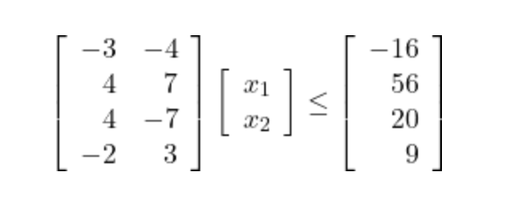

# CSE 521: Compiler Construction
## Programming Assignment 2 : Fourier Motzkin Elimination

Submitted by-
1. Durva Dev (dbd5616)
2. Raghav Kumar (rfk5511)

### To run

`python rational_fme.py`

`python integer_fme.py`

Then follow the inputs.

**NB:** Instead of *stdin*, input can also be supplied from a file. Look at the next section for format.

### Input format:

1. First line contains the number of variables (n)
2. Second line contains the number of constraints (m)
3. Third line contains `n * m` space separated floating point numbers that represent the entries of matrix `A` in row major order
4. Fourth line contains `m` space separated floating point numbers that represent the entris of column vector `b`.

#### For example

The following system will be input as

**System of inequalities**


**Program input**
```
2
4
-3 -4 4 7 4 -7 -2 3
-16 56 20 9
```

If the input is saved as above in a file named `sample_input.txt`, then one can simply run 

```
python integer_fme.py < sample_input.txt
``` 
or 

```
python rational_fme.py < sample_input.txt
```

to get the result.

### Output format

#### 1. Rational FME

`rational_fme.py` simply outputs whether a `Solution exists` or `Solution does not exist` for the system of supplied inequality at the end. In addition to this, it also outputs the intermediate coefficient matrix (`A'`), constant vector (`b'`), and matrices representing the lower bounds (`lb`) and upper bounds (`ub`) for variable `x_i` after eliminating it in round `n-i-1` (Variables are eliminated starting from `x_n` to `x_1`).

Matrices `lb` and `ub` represent the lower bound and upper bound found on a variable `x_i`. A row `[c1 c2 c3]` in matrix `lb` represents that `(c1 * x_1) + (c2 * x_2) + c3 <= x_3`, but when present in matrix `ub` it represents that `x_3 <= (c1 * x_1) + (c2 * x_2) + c3`. Since multiple upper and lower bounds may be found for a variable, say `x_3`, therefore `lb` and `ub` may have multiple row. If either `lb`, or `ub` is empty then it implies that the variable, say `x_3` is unconstrained in that direction meaning it can go to +INF or -INF. (INF has been assumed to be 5 Million here)

#### 2. Integer FME

At the end, integer FME outputs a loop nest which when run in a Python terminal will print out all the integer solutions that satisfy the given system of inequalities if they exist, else it will output `Solution does not exist`. The intermediate outputs of integer FME is same as that of rational FME stated above, and additionally, it includes whether projection for each variable from `x_1` to `x_n` were `exact` or `inexact`

### About code

All code is in files *rational_fme.py* and *integer_fme.py*

Sample input files can also be found in the root folder